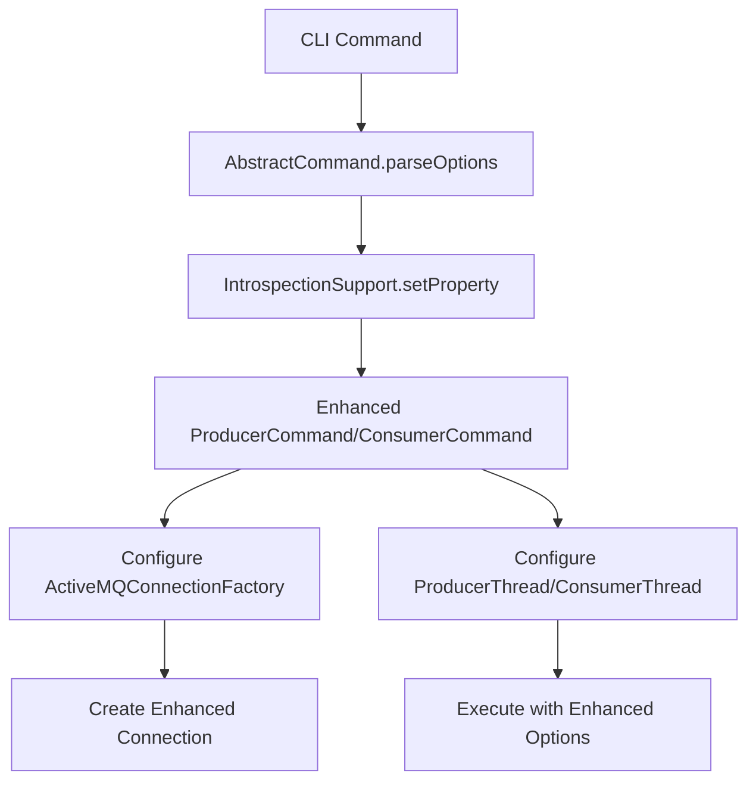

# Design Document

## Overview

This design enhances the ActiveMQ CLI producer and consumer commands by exposing additional configuration options that are available in the underlying ActiveMQ client libraries but not currently accessible through the command-line interface. The enhancement maintains backward compatibility while providing comprehensive configuration capabilities for testing, performance tuning, and troubleshooting scenarios.

The design leverages the existing command parsing infrastructure in `AbstractCommand` which uses Java reflection via `IntrospectionSupport.setProperty()` to automatically map command-line options to setter methods on command objects.

## Architecture

### Current Architecture

The existing CLI commands follow this pattern:
1. `AbstractCommand` handles option parsing using `--optionName value` format
2. Options are automatically mapped to setter methods via reflection
3. Commands extend `AbstractCommand` and implement `runTask()`
4. Producer/Consumer commands create and configure `ProducerThread`/`ConsumerThread` instances
5. Help text is loaded from `.txt` files in resources

### Enhanced Architecture

The enhanced architecture maintains the same pattern but extends it:



### Key Design Principles

1. **Backward Compatibility**: All existing options continue to work unchanged
2. **Reflection-Based Configuration**: Leverage existing `IntrospectionSupport` for automatic option mapping
3. **Comprehensive Coverage**: Expose all relevant configuration options from underlying libraries
4. **Clear Documentation**: Enhanced help text with categorized options
5. **Validation**: Proper error handling for invalid option combinations

## Components and Interfaces

### Enhanced ProducerCommand

**New Properties Added:**
```java
// Connection Configuration
private int connectResponseTimeout = 0;
private boolean useCompression = false;
private boolean alwaysSyncSend = false;
private int producerWindowSize = 0;
private boolean copyMessageOnSend = true;
private boolean useAsyncSend = false;
private int sendTimeout = 0;
private boolean dispatchAsync = true;
private int closeTimeout = 15000;

// Message Configuration  
private boolean runIndefinitely = false;
private long deliveryDelay = 0L;
private Map<String, String> messageProperties = new HashMap<>();

// SSL Configuration
private String sslKeyStore;
private String sslKeyStorePassword;
private String sslTrustStore;
private String sslTrustStorePassword;
private String sslProtocol;
private String sslCipherSuites;
private boolean sslHostnameVerification = true;

// Performance and Monitoring
private boolean statsEnabled = false;
private int auditDepth = 2048;
private int auditMaximumProducerNumber = 64;
private boolean optimizeAcknowledge = false;
private long optimizeAcknowledgeTimeOut = 300;

// Threading
private int maxThreadPoolSize = 1000;
private boolean useDedicatedTaskRunner = false;

// Serialization
private boolean objectMessageSerializationDefered = false;
private List<String> trustedPackages = new ArrayList<>();
private boolean trustAllPackages = false;
private boolean nestedMapAndListEnabled = true;
```

**Enhanced Methods:**
```java
// Configure connection factory with new options
private void configureConnectionFactory(ActiveMQConnectionFactory factory)

// Configure SSL if SSL options are provided  
private void configureSSL(ActiveMQConnectionFactory factory)

// Parse message properties from command line format
private void parseMessageProperties(String propertiesString)

// Enhanced producer thread configuration
private void configureProducerThread(ProducerThread producer)
```

### Enhanced ConsumerCommand

**New Properties Added:**
```java
// Connection Configuration (same as producer)
private int connectResponseTimeout = 0;
private boolean useCompression = false;
// ... (other connection options)

// Consumer-Specific Configuration
private int receiveTimeOut = 3000;
private String messageSelector;
private String subscriptionName;
private boolean breakOnNull = true;
private boolean useRetroactiveConsumer = false;
private boolean exclusiveConsumer = false;
private boolean displayMessageProperties = false;
private boolean displayMessageHeaders = false;

// SSL Configuration (same as producer)
private String sslKeyStore;
// ... (other SSL options)

// Performance and Monitoring (same as producer)
private boolean statsEnabled = false;
// ... (other performance options)
```

**Enhanced Methods:**
```java
// Configure connection factory with new options
private void configureConnectionFactory(ActiveMQConnectionFactory factory)

// Configure consumer-specific options
private void configureConsumerThread(ConsumerThread consumer)

// Enhanced message display with properties/headers
private void displayMessage(Message message)
```

### Configuration Categories

Options are logically grouped into categories for better organization:

1. **Connection Options**: Basic connection settings, timeouts, SSL
2. **Message Options**: Message-specific settings, properties, transformations  
3. **Performance Options**: Threading, batching, optimization settings
4. **Monitoring Options**: Statistics, auditing, logging
5. **Advanced Options**: Serialization, failover, specialized behaviors

## Data Models

### SSL Configuration Model
```java
public class SSLConfig {
    private String keyStore;
    private String keyStorePassword;
    private String trustStore; 
    private String trustStorePassword;
    private String protocol;
    private String cipherSuites;
    private boolean hostnameVerification;
    
    public void applyTo(ActiveMQConnectionFactory factory) {
        // Configure SSL on connection factory
    }
}
```

### Message Properties Model
```java
public class MessagePropertiesConfig {
    private Map<String, String> properties;
    
    public void parseFromString(String propertiesString) {
        // Parse "key1=value1,key2=value2" format
    }
    
    public void applyTo(Message message) {
        // Set properties on JMS message
    }
}
```

### Statistics Model
```java
public class CommandStatistics {
    private long startTime;
    private long endTime;
    private AtomicLong messageCount;
    private AtomicLong byteCount;
    
    public void displayStats() {
        // Display throughput and timing statistics
    }
}
```

## Error Handling

### Validation Rules

1. **SSL Configuration**: If any SSL option is provided, validate that required SSL options are present
2. **Message Properties**: Validate property string format and detect invalid property names
3. **Timeout Values**: Ensure timeout values are non-negative
4. **Thread Counts**: Validate thread pool sizes are positive
5. **Option Combinations**: Detect and report incompatible option combinations

### Error Messages

```java
public class ValidationErrors {
    public static final String SSL_INCOMPLETE = 
        "SSL configuration incomplete. When using SSL options, both keyStore and trustStore must be specified.";
    
    public static final String INVALID_PROPERTY_FORMAT = 
        "Invalid message property format. Use: key1=value1,key2=value2";
    
    public static final String NEGATIVE_TIMEOUT = 
        "Timeout values must be non-negative. Invalid value: %d";
    
    public static final String INVALID_THREAD_COUNT = 
        "Thread pool size must be positive. Invalid value: %d";
}
```

## Testing Strategy

### Unit Tests

1. **Option Parsing Tests**: Verify all new options are correctly parsed and mapped
2. **Validation Tests**: Test error handling for invalid option combinations
3. **Configuration Tests**: Verify connection factory and thread configuration
4. **Backward Compatibility Tests**: Ensure existing functionality unchanged

### Integration Tests

1. **End-to-End Tests**: Test complete producer/consumer workflows with new options
2. **SSL Tests**: Test SSL configuration with test certificates
3. **Performance Tests**: Verify performance options work as expected
4. **Error Scenario Tests**: Test error handling in real broker scenarios

### Test Categories

```java
@Category(UnitTest.class)
public class ProducerCommandOptionParsingTest {
    // Test option parsing and validation
}

@Category(IntegrationTest.class) 
public class EnhancedProducerIntegrationTest {
    // Test with real broker connections
}

@Category(PerformanceTest.class)
public class ProducerPerformanceTest {
    // Test performance-related options
}
```

### Mock Strategy

- Mock `ActiveMQConnectionFactory` for unit tests
- Mock `ProducerThread`/`ConsumerThread` for configuration tests  
- Use embedded broker for integration tests
- Use test SSL certificates for SSL tests

## Implementation Approach

### Phase 1: Core Infrastructure
1. Add new properties to command classes
2. Implement configuration methods
3. Update help text files
4. Add basic validation

### Phase 2: Advanced Features  
1. Implement SSL configuration
2. Add message properties support
3. Implement statistics collection
4. Add performance monitoring

### Phase 3: Testing and Documentation
1. Comprehensive test suite
2. Updated documentation
3. Performance benchmarking
4. User acceptance testing

### Backward Compatibility Strategy

1. **Default Values**: All new options have sensible defaults
2. **Optional Parameters**: New options are optional and don't affect existing behavior
3. **Help Text**: Clearly separate existing and new options in help output
4. **Error Messages**: Maintain existing error message format for existing options

## Configuration Examples

### Enhanced Producer Usage
```bash
# Basic usage (unchanged)
activemq producer --destination queue://test --messageCount 100

# With SSL configuration
activemq producer --destination queue://test \
  --sslKeyStore /path/to/keystore.jks \
  --sslKeyStorePassword secret \
  --sslTrustStore /path/to/truststore.jks \
  --sslTrustStorePassword secret

# With performance tuning
activemq producer --destination queue://test \
  --useAsyncSend true \
  --producerWindowSize 1024 \
  --useCompression true \
  --parallelThreads 10

# With message properties
activemq producer --destination queue://test \
  --messageProperties "priority=high,source=test,timestamp=$(date +%s)"
```

### Enhanced Consumer Usage
```bash
# With message selector
activemq consumer --destination queue://test \
  --messageSelector "priority='high' AND source='test'"

# With SSL and monitoring
activemq consumer --destination queue://test \
  --sslKeyStore /path/to/keystore.jks \
  --sslKeyStorePassword secret \
  --statsEnabled true \
  --displayMessageProperties true

# Durable subscription with custom name
activemq consumer --destination topic://test \
  --durable true \
  --clientId testClient \
  --subscriptionName testSubscription
```